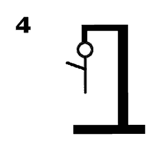

# Skill-Galgje
<<<<<<< HEAD

**Team:** <Paart>  
**Spelvolgorde & contact:**
1. <Naam 1> – Seb
2. <Naam 2> – Anouar
3. <Naam 3> – Jesse
4. <Naam 4> – Tim
=======

---

## Woordraster
<!-- Pas het aantal kolommen aan aan de woordlengte -->
<<<<<<< HEAD
| r | . | . | . | s | . | a | . | e | r | s | . | a | a | . |
| - | - | - | - | - | - | - | - | - | - | - | - | - | - | - |
| 1 | 2 | 3 | 4 | 5 | 6 | 7 | 8 | 9 | 10 | 11 | 12 | 13 | 14 | 15 |

## Status

C, M, I
---

## Beurtenlog
- beurt1: <seb> gokt "a"
- goed
<<<<<<< HEAD
- beurt2: Anouar c
- fout
- beurt3: Jesse s
- goed
- beurt4: seb e
- goed
- beurt5: Anouar r
- goed
- beurt6: Jesse m
- fout
- beurt7: seb i
- fout
- buert8: Anouar f
=======
